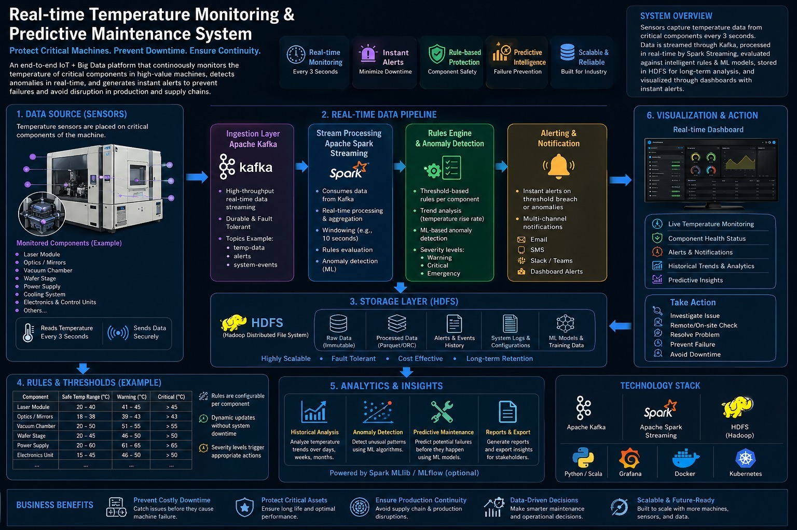

# Thermal Protection System



## Overview

The Thermal Protection System is a comprehensive IoT-based solution for real-time temperature monitoring and anomaly detection. This project integrates multiple big data technologies including Apache Kafka, Hadoop HDFS, Apache Spark, and machine learning algorithms to provide a robust monitoring system for thermal sensors.

## Features

- **Real-time Data Ingestion**: Utilizes Apache Kafka for streaming temperature sensor data
- **Distributed Storage**: Employs Hadoop HDFS for scalable and reliable data storage
- **Data Processing**: Leverages Apache Spark for efficient data processing and feature engineering
- **Anomaly Detection**: Implements Isolation Forest algorithm for detecting temperature anomalies
- **Containerized Deployment**: Uses Docker Compose for easy deployment and management of all services

## Architecture

The system consists of four main components:

1. **HDFS Layer**: Handles distributed storage of temperature data
2. **Kafka Layer**: Manages real-time data streaming from sensors
3. **Spark Layer**: Processes and analyzes sensor data
4. **ML Layer**: Performs anomaly detection using machine learning

## Components

### HDFS (hdfs/)
- `docker-compose.yml`: Container configuration for Kafka, Zookeeper, and HDFS services
- `save_data_to_hdfs.py`: Main script for saving simulated sensor data to HDFS
- `read_from_hdfs.py`: Script for reading and analyzing historical data from HDFS
- `save_to_hdfs.py`: Continuous monitoring script that sends data to Kafka

### Kafka (kafka/)
- `sensor_data.csv`: Sample sensor data for testing

### ML (ML/)
- `isolation_forest_detector.py`: Machine learning script for anomaly detection
- `requirements-14.txt`: Python dependencies for the ML component

### Spark (spark/)
- `final_spark.ipynb`: Jupyter notebook for sensor data feature engineering
- `spark_data.csv`: Processed sensor data

## Installation

### Prerequisites
- Docker and Docker Compose
- Python 3.8+
- Java 8+ (for Hadoop)

### Setup
1. Clone the repository:
   ```bash
   git clone <repository-url>
   cd Thermal-Protection-System
   ```

2. Start the services using Docker Compose:
   ```bash
   cd hdfs
   docker-compose up -d
   ```

3. Install Python dependencies for ML component:
   ```bash
   cd ../ML
   pip install -r requirements-14.txt
   ```

## Usage

### Running the HDFS Storage Layer
1. Navigate to the hdfs directory
2. Run the data saving script:
   ```bash
   python save_data_to_hdfs.py
   ```
3. Run the continuous monitoring script:
   ```bash
   python save_to_hdfs.py
   ```
4. Read data from HDFS:
   ```bash
   python read_from_hdfs.py
   ```

### Running Anomaly Detection
1. Navigate to the ML directory
2. Execute the anomaly detection script:
   ```bash
   python isolation_forest_detector.py
   ```

### Data Processing with Spark
1. Navigate to the spark directory
2. Open the Jupyter notebook:
   ```bash
   jupyter notebook final_spark.ipynb
   ```
3. Run the cells to process sensor data

## Data Flow

1. Temperature sensors send data to Kafka topics
2. Data is consumed and stored in HDFS for persistence
3. Spark processes the data for feature engineering
4. Machine learning models analyze the data for anomalies
5. Alerts are generated for detected anomalies

## Configuration

- **Kafka**: Runs on port 9092
- **Zookeeper**: Runs on port 2181
- **HDFS**: NameNode and DataNode configured via Docker Compose
- **Spark**: Configured for local execution

## Monitoring

Check service status:
```bash
docker ps
```

View HDFS data:
```bash
docker exec -it hadoop-container bash -c "hdfs dfs -cat /data/temperature/temp_data.json"
```

## Contributing

1. Fork the repository
2. Create a feature branch
3. Commit your changes
4. Push to the branch
5. Create a Pull Request


## Acknowledgments

- Apache Kafka for data streaming
- Hadoop HDFS for distributed storage
- Apache Spark for data processing
- Scikit-learn for machine learning algorithms